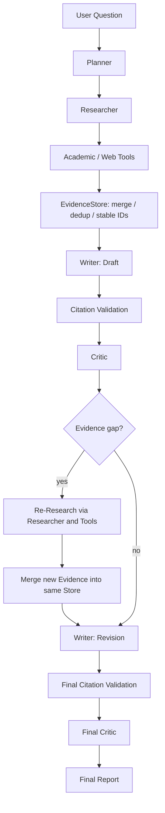
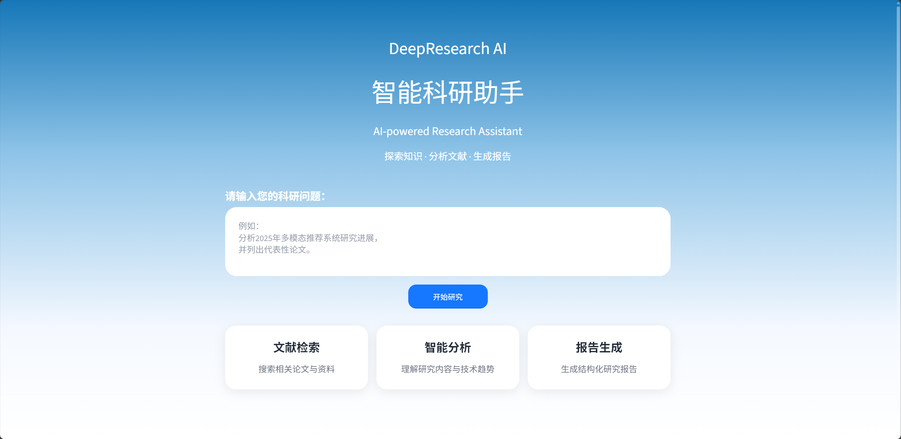

# DeepResearch-Agent

A multi-role academic Deep Research Agent built with LangChain, featuring evidence-grounded reports, citation validation, critic-guided re-research, resumable workflows, and realtime research progress.

面向学术研究的多角色研究助手：从一个问题出发，检索证据、撰写报告、审核引用与证据支持度，并按需补充研究。提供 CLI、FastAPI 和 Streamlit 入口。

## Features

- Planner 拆解任务，Researcher 调用工具，Writer 写作与修订，Critic 审核与提出补搜问题。
- OpenAlex + Semantic Scholar 聚合、单源失败时保留其他来源结果；DDGS 网页搜索通过工具路由使用。
- Query-aware 词法排序，保留年份过滤、去重、预算和结果数量限制。
- EvidenceStore 去重、元数据合并、稳定 Evidence ID、来源与检索时间记录。
- 正文 `[E#]` 引用、程序化 References、两层引用与证据支持度校验。
- 阶段级 Checkpoint / Resume、持久化 Research Memory。
- FastAPI JSON API、实时 SSE、Streamlit 前端。
- pytest 离线测试与 GitHub Actions 测试工作流。

## Architecture



初稿和修订稿生成后，Python 均根据正文引用附加 References；引用校验分离正文与参考文献。无需补搜时仍执行 Revision 和 Final Critic。Final Critic 后结束本次流程，不会无限循环研究。

| 组件 | 职责 |
|---|---|
| Planner | Prompt + Structured Output，生成研究目标、子问题和 SearchType |
| Researcher | 受工具路由约束的 Tool Calling 循环，返回结构化 Evidence |
| Writer | Prompt Chain 生成初稿与修订稿，不调用搜索工具 |
| Critic | Structured Output，检查报告与证据支持度，返回问题和补搜建议 |
| EvidenceStore | 统一去重、合并元数据和分配稳定 ID |
| Pipeline | 确定性阶段编排、检查点、恢复、进度回调与角色衔接 |

**LangChain implements role-level LLM capabilities such as Prompt Chains, Structured Output and Tool Calling, while a custom Python Pipeline handles deterministic workflow orchestration.** 项目没有使用 LangGraph 编排，也不是多个自主 Agent 自由协作。

## Evidence Grounding

EvidenceStore 分配任务内稳定的 E1、E2 等 ID。Writer 在事实陈述旁生成 `[E1][E2]`；Python 将这些指针解析到 Store 中的 title、authors、year、DOI 和 URL，生成引用过的证据条目。

**LLM generates citation pointers; deterministic Python code resolves citation metadata.** Writer 不生成自由格式参考文献；未知 ID 不会被补造 References。这个设计降低参考文献元数据被编造的风险，但输入 Evidence 仍可能不完整或不准确，引用存在也不等于结论真实。

## Citation Validation

1. **Deterministic Python Validation**：检查支持的 `[E#]` 格式和 ID 是否存在，分离 References，提取带引用的陈述并建立 claim ↔ citation 映射。
2. **Critic Evidence Support Review**：在现有 Critic 调用中，基于引用指向的 Evidence 给出 supported、partially_supported 或 unsupported。遗漏或不匹配的支持度检查记录为未完成，不能默认通过。

Critic 判断需要补充证据时，沿用 Evidence Gap → Research Query → Re-Research → New Evidence → Revision 流程。校验面向已检索的 Evidence，不是独立事实核验保证。

## Query-aware Academic Search

```text
User query → OpenAlex + Semantic Scholar
           → Candidate Papers → merge / dedup
           → year filter / cross-call dedup
           → lexical relevance ranking → top results
```

排序使用 query token 在标题与摘要中的覆盖率（权重 0.7 / 0.3），标题完整词序列匹配加 0.1，最高 1.0。同分保持输入顺序，不以引用量或年份代替相关性，不通过分数阈值删除候选。`paper_search` 每次最多返回 5 篇。

这是 lightweight lexical relevance，不使用 Embedding、BM25 或 Vector Search。学术检索不限于推荐系统主题，可用于 RAG、医学图像分割、LLM agents、数据库优化等问题。两家学术 provider 分别尝试；这不表示失败后一定自动转为网页搜索，网页工具可用性由 SearchType 决定。

## Realtime Research Progress

```text
Pipeline → WorkflowEvent → callback → request-local Queue
         → FastAPI StreamingResponse → SSE → Streamlit
```

同步 Pipeline 在工作线程中执行，阶段事件立即进入当前请求的队列，无需等待完整报告。事件字段为 type、stage、message、data；支持：

```text
workflow_started / stage_started / stage_completed
progress / warning / workflow_completed / workflow_failed
```

这是 **stage-level realtime progress**，不逐 token 输出模型文本，也不展示 Prompt 或隐藏推理。最终报告与证据只在 `workflow_completed.data` 中发送。失败时发送安全的 workflow_failed 并结束流；SSE 已开始后需检查事件，不能仅靠 HTTP 200 判断研究成功。

## Project Structure

```text
DeepResearch-Agent/
├── api/                  # JSON API、SSE 与线程队列桥接
├── frontend/             # Streamlit UI、增量 SSE 解析
├── models/               # Paper、Evidence、Store、State、Critic 数据模型
├── workers/              # 四个角色的 Prompt / Chain / Tool Calling
├── workflow/             # Pipeline、路由、引用处理、事件、恢复
├── tools/                # 学术及网页搜索，academic/ 含 provider 与排序
├── tests/                # 离线单元及集成测试
├── docs/                 # 项目图片和验证记录
├── .github/workflows/    # GitHub Actions 测试
├── main.py               # CLI 入口
├── llm.py                # 模型配置工厂
├── memory.py             # 持久化研究记忆
├── requirements.txt      # 固定版本的直接依赖
├── .env.example          # 不含凭据的环境变量模板
└── README.md
```

## Quick Start

已验证的开发环境为 Python 3.11。需要能访问所选模型和检索服务的网络。

```bash
git clone https://github.com/jiangzijie88-ops/DeepResearch-Agent.git
cd DeepResearch-Agent
conda create -n deepresearch python=3.11
conda activate deepresearch
python -m pip install -r requirements.txt
```

复制配置模板（已有 .env 时不要覆盖）：

```bash
cp .env.example .env
```

Windows PowerShell 使用 `Copy-Item .env.example .env`，cmd 使用 `copy .env.example .env`。编辑 .env：

| 变量 | 说明 |
|---|---|
| LLM_PROVIDER | deepseek（默认）或 openai |
| DEEPSEEK_API_KEY / DEEPSEEK_MODEL / DEEPSEEK_BASE_URL | 选择 deepseek 时三项必填 |
| OPENAI_API_KEY / OPENAI_MODEL / OPENAI_BASE_URL | 选择 openai 时三项必填 |
| OPENALEX_API_KEY | 学术 provider 凭据，由 OpenAlex adapter 读取 |
| SEMANTIC_SCHOLAR_API_KEY | 学术 provider 凭据，由 Semantic Scholar adapter 读取 |

模型名称与 base URL 填写你所选服务实际提供的值。模型需支持 Tool Calling 和结构化输出；代码使用 Chat Completions，并为 DeepSeek 配置关闭 thinking。未选择的模型 provider 字段可以留空。学术 adapter 允许未提供 key，但服务是否接受请求、配额与限流取决于 provider。

真实研究会调用外部服务，可能产生模型费用；测试使用 fake 数据与安全 dummy 配置。不要提交 .env。

## CLI Usage and Resume

```bash
python main.py
```

按提示输入问题。CLI 在 outputs/ 保存 report_*.md、critic_*.json（有最终审核时）、state_*.json、workflow_*.log 和 memory.json。

```bash
python main.py --resume outputs/state_YYYYMMDD_HHMMSS.json
```

替换为实际检查点路径。Resume 是 **stage-level recovery**：重启未完成的阶段，不是从中断的模型 token 或工具调用精确续跑；已完成检查点直接展示结果并退出。Research Memory 是历史上下文，ResearchState 是当前任务检查点，两者职责不同。

## FastAPI

在项目根目录启动：

```bash
python -m uvicorn api.server:app --host 127.0.0.1 --port 8000 --reload
```

交互文档：<http://127.0.0.1:8000/docs>。

| 接口 | 行为 |
|---|---|
| GET / | 服务存活信息 |
| POST /research | 同步研究，完成后返回 JSON |
| POST /research/stream | 实时 SSE 阶段事件，最后返回报告 |

两个 POST 接口的请求均为 `{"question": "..."}`。以下为 Bash/curl 示例：

```bash
curl -X POST http://127.0.0.1:8000/research \
  -H 'Content-Type: application/json' \
  -d '{"question":"Find GraphRAG papers from 2024 to 2026 and summarize major research directions."}'

curl -N -X POST http://127.0.0.1:8000/research/stream \
  -H 'Content-Type: application/json' \
  -d '{"question":"Find GraphRAG papers from 2024 to 2026 and summarize major research directions."}'
```

普通响应字段为 question、status、report、evidence_count、evidence。SSE 每帧以空行结束，JSON 支持中文，例如：

```text
event: stage_started
data: {"type":"stage_started","stage":"planner","message":"正在生成研究计划","data":{}}

```

该流使用 POST，客户端需增量读取响应；浏览器原生 EventSource 的 GET 调用方式不适用于此接口。

## Streamlit

保持 FastAPI 运行，在第二个终端执行：

```bash
conda activate deepresearch
python -m streamlit run frontend/app.py
```

打开 <http://localhost:8501>。Streamlit 从 http://127.0.0.1:8000/research/stream 逐条消费 SSE 并更新进度，最终显示报告和证据表格。路径为 **Streamlit → FastAPI → Pipeline**。

CLI 和 Web 共用研究流程与 Research Memory；Web 当前没有 checkpoint/resume 接口，也不自动保存 CLI 的整套报告与日志文件。

## Example / Demo

问题：

> Find GraphRAG papers from 2024 to 2026 and summarize major research directions.

下面是**格式示意**，不是一次真实运行的逐字记录；数字和证据名是占位示例：

```text
正在生成研究计划 → 研究计划生成完成
正在检索研究证据 → 已收集研究证据（17 条证据）
正在撰写报告初稿 → 正在校验报告引用
正在审查报告质量 → 按需补搜 → 正在修订研究报告
正在校验修订报告引用 → 正在进行最终审查 → 研究完成
```

报告结构示意：

```markdown
## 目标时间范围内论文（2024–2026）
根据检索证据归纳的方法与研究方向…… [E1]

## 背景参考
范围外论文只用于背景分析，并明确标注年份…… [E2]

## References
[E1] <目标范围内论文标题>. <作者>. <年份>.
URL: <Evidence 中的来源地址>

[E2] <背景论文标题>. <作者>. 2023.
URL: <Evidence 中的来源地址>
```

年份分组由初稿和修订共用的 Writer 指令约束，不是额外的确定性报告过滤器。

已有界面截图（历史报告展示，不作为当前实时进度的验证记录）：



## Tests

```bash
python -m pytest -q
python -m pip check
```

测试隔离 .env，使用 fake 模型、provider 和 HTTP transport，阻止 Requests / HTTPX 真实请求。覆盖角色链、检索排序、去重、引用校验、Pipeline、Resume、API、SSE 和 Streamlit。

最近本地验证（2026-09-30，Windows / Python 3.11）：**238 passed / 0 failed**；使用 `python -m pytest -q -p no:cacheprovider`，仅关闭 pytest 缓存。`pip check` 通过。本轮没有重新创建全新环境安装依赖，也没有调用真实外部 API。

SSE 测试让 Fake Pipeline 发出早期事件后阻塞，客户端收到该事件才解除阻塞，证明 Pipeline 完成前即可收到进度。

GitHub Actions 配置位于 [tests.yml](.github/workflows/tests.yml)，在 push / pull request 时使用 Ubuntu 和 Python 3.11 安装依赖并执行 `python -m pytest -q`。依赖安装需要网络，测试不需要真实 API key。新增工作流尚待首次远端运行验证，不展示未经验证的绿色 CI 徽章。

## Limitations

- 检索覆盖和质量取决于 provider 可用性、查询质量和元数据完整性；引用量是随时间变化的快照。
- 排序是词法匹配，不能替代语义检索；学术工具保留年份与结果数量限制。
- 引用校验衡量已检索 Evidence 的支持度，不能保证绝对事实正确或捕获全部未引用陈述。
- 年份分组是 Prompt 约束，模型仍可能违反，需人工检查；completed 只表示流程结束，不代表最终审核无问题。
- Resume 是阶段级恢复；SSE 是阶段进度，不是 token streaming。断开 SSE 不会强制取消执行中的模型请求。
- Web 没有复用 CLI 全局 stdout/stderr 文件日志机制，详细执行信息仍见服务端终端。
- 项目面向本地使用：SSE 队列按请求隔离，但搜索预算/跨调用去重和磁盘 Memory 仍有进程共享状态，不承诺完整多用户并发隔离；没有鉴权或部署加固。
