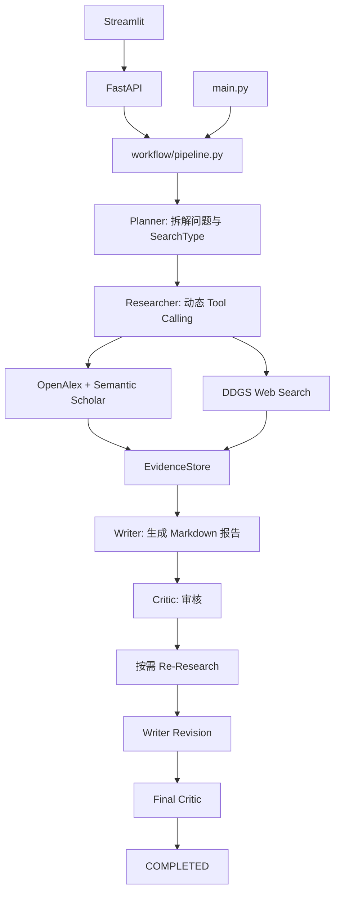

# DeepResearch-Agent

A LangChain-based multi-agent research assistant.

面向科研检索的多角色研究助手：自动拆解研究问题，调用学术或网页搜索工具，汇总结构化证据，生成研究报告并进行审核。项目提供
CLI、FastAPI 和 Streamlit Web Demo，并通过自定义 Pipeline
编排完整研究流程。

## 核心能力

-   **多角色协作**：Planner → Researcher → Writer →
    Critic，支持按需补充检索、报告修订与最终审核。
-   **动态工具调用**：Planner 为子问题选择 `paper_search`、`web_search`
    或 `hybrid`，Researcher 使用 LangChain Tool Calling 执行对应搜索。
-   **多源学术检索**：聚合 OpenAlex 和 Semantic Scholar，并支持 DDGS Web
    Search。
-   **结构化证据管理**：EvidenceStore 对
    DOI、URL、标题及年份等信息进行去重与元数据合并。
-   **状态与记忆**：CLI 支持 checkpoint / resume，并通过 Persistent
    Research Memory 保存历史研究记录。
-   **Web Demo**：Streamlit 前端通过 FastAPI 调用共用
    Pipeline，展示研究报告与证据表格。

## Web Demo

Web 界面支持输入研究问题，并展示界面。


## 工作流程



核心流程为：

**Planner → Researcher → Writer → Critic → 按需 Re-Research → Revision →
Final Critic**

`workflow/pipeline.py` 负责流程编排、状态管理、Evidence Store
和恢复；LangChain 相关模型、Prompt、Structured Output 与 Tool Calling
逻辑主要封装在 `workers/` 和 `workflow/stages.py` 中。

## Architecture

  -----------------------------------------------------------------------------------------
  组件                                实现与职责
  ----------------------------------- -----------------------------------------------------
  Planner                             `ChatPromptTemplate` + Structured Output，生成
                                      Pydantic `ResearchPlan`

  Researcher                          LangChain Tool Calling，根据 `SearchType`
                                      动态调用学术或网页搜索工具

  Writer                              LCEL
                                      Chain：`prompt \| model \| StrOutputParser()`，基于
                                      Evidence 生成或修订报告

  Critic                              Structured Output，返回
                                      `CriticReview`，负责初次审核和 Final Critic

  Memory                              Persistent Research Memory，保存历史研究记录并向
                                      Planner 提供上下文

  Tools                               `paper_search` + `web_search`，使用 LangChain `@tool`
                                      封装搜索能力

  Workflow                            自定义 Pipeline
                                      Orchestration，负责阶段执行、状态与恢复
  -----------------------------------------------------------------------------------------

模型层基于 `langchain_openai.ChatOpenAI`，支持 DeepSeek /
OpenAI-compatible API。项目使用自定义 Pipeline 编排工作流，不直接使用
LangGraph API。

Memory、Context 与 State 的职责不同：**Research Memory**
持久化历史研究记录；**Message Context** 保存单次调用中的
Prompt、模型消息和工具结果；**State / Resume** 保存 Pipeline
阶段进度并支持 checkpoint 恢复。

## 技术栈

Python 3.11、LangChain / LangChain Core / LangChain OpenAI、Pydantic
2、FastAPI、Uvicorn、Streamlit、OpenAlex、Semantic
Scholar、DDGS、pytest、HTTPX、Git。

## 项目结构

``` text
DeepResearch-Agent/
├── api/server.py              # FastAPI 后端接口
├── frontend/app.py            # Streamlit Web UI
├── workers/                   # Planner / Researcher / Writer / Critic
├── workflow/                  # Pipeline、阶段调用、路由与恢复
├── models/                    # State、Evidence、论文及审核等数据模型
├── tools/academic/            # OpenAlex、Semantic Scholar 与聚合器
├── tools/                     # 学术与 Web 搜索工具
├── memory.py                  # Persistent Research Memory
├── tests/                     # 离线回归测试
├── main.py                    # CLI 入口
├── llm.py                     # LLM 配置
└── requirements.txt           # 项目依赖
```

## 快速开始

### 1. 安装环境

``` bash
conda create -n deepresearch python=3.11
conda activate deepresearch
python -m pip install -r requirements.txt
```

### 2. 配置模型


DeepSeek：

``` dotenv
LLM_PROVIDER=deepseek
DEEPSEEK_API_KEY=your-api-key
DEEPSEEK_MODEL=your-model-name
DEEPSEEK_BASE_URL=https://api.deepseek.com
```

OpenAI：

``` dotenv
LLM_PROVIDER=openai
OPENAI_API_KEY=your-api-key
OPENAI_MODEL=your-model-name
OPENAI_BASE_URL=https://api.openai.com/v1
```

可选学术检索配置：

``` dotenv
OPENALEX_API_KEY=your-openalex-key
SEMANTIC_SCHOLAR_API_KEY=your-semantic-scholar-key
```

`LLM_PROVIDER` 未配置时默认为 `deepseek`。所选模型需支持 Tool Calling。

### 3. 启动 Web Demo

分别打开两个终端，并在项目根目录运行：

``` bash
# 终端 1：FastAPI 后端
python -m uvicorn api.server:app --reload
```

``` bash
# 终端 2：Streamlit 前端
python -m streamlit run frontend/app.py
```

启动后访问 Web 页面 `http://localhost:8501`，API 文档位于
`http://127.0.0.1:8000/docs`。

### 4. CLI 与 Resume

``` bash
python main.py
```

CLI 运行产生的日志、报告、审核结果、checkpoint 和记忆保存在 `outputs/`。

``` bash
python main.py --resume outputs/state_YYYYMMDD_HHMMSS.json
```

Resume 以 Pipeline 阶段为粒度，不是单个工具调用级别的精确续跑。

## 示例问题

``` text
查找 2024–2025 年关于图神经网络的多模态推荐论文，
简述核心方法并给出来源。
```

## 测试

``` bash
python -m pytest -q
python -m py_compile main.py workflow/pipeline.py api/server.py frontend/app.py models/research_state.py
python -m pip check
```

离线测试覆盖 LangChain Chain、Tool Calling、结构化解析、Evidence
Store、Pipeline、Resume、API 和 Streamlit 界面，不需要真实 API
Key。正式使用前建议通过 CLI 或 Web Demo 完成一次真实端到端验证。

## CLI 与 Web

  能力                          CLI   Web
  ----------------------------- ----- -----
  完整研究 Pipeline             ✓     ✓
  Evidence 去重与合并           ✓     ✓
  Critic 补搜、修订与最终审核   ✓     ✓
  checkpoint / resume           ✓     ---
  Persistent Research Memory    ✓     ---
  报告与审核结果自动落盘        ✓     ---
  Web 报告与证据表格            ---   ✓

## 已知限制

-   当前 Web Demo
    为同步执行，主要面向本地单用户使用；尚未提供任务队列、鉴权和实时 SSE
    / WebSocket。
-   外部学术与网页检索受网络、API 限流和数据源可用性影响。
-   Critic 用于报告审核，但 `COMPLETED`
    仅表示流程执行结束，不代表所有内容均经过独立事实核验。
-   Resume 为阶段级 checkpoint 恢复，不支持工具调用级精确续跑。
