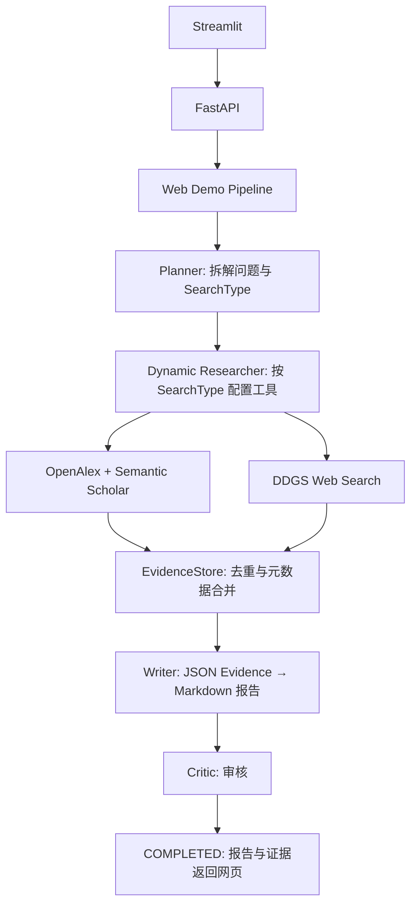
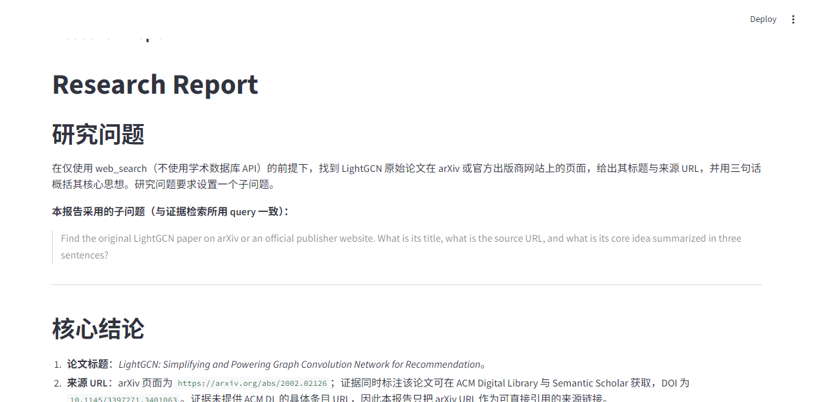
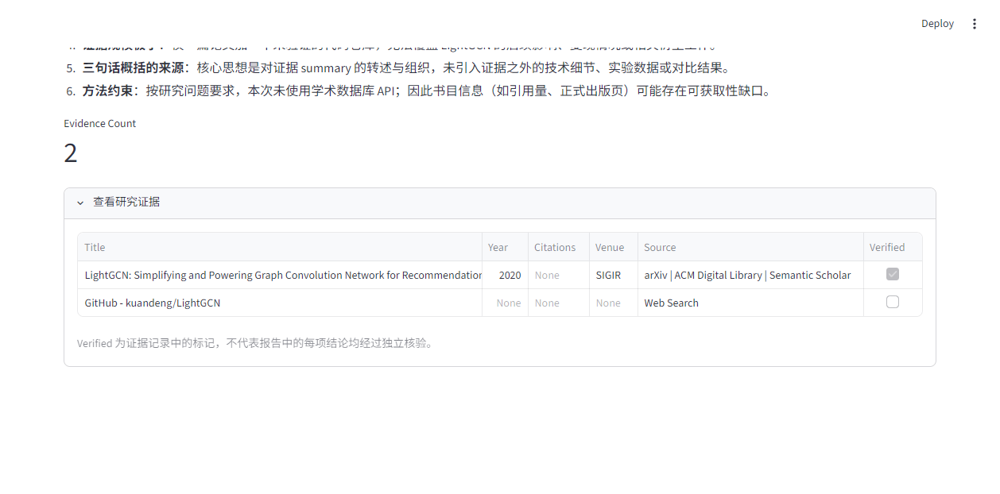

# DeepResearch-Agent

面向科研检索的多智能体研究助手：拆解问题、按任务选择学术或网页工具、汇总结构化证据、生成报告并审核结果。

**v3 定位：可运行、可测试的 FastAPI + Streamlit Web Demo。** CLI 保留更完整的持久化、恢复、补搜和修订流程。

## 版本演进

| 版本 | 重点 |
| --- | --- |
| v1 | 单 Agent、OpenAlex / Web 搜索、多轮工具调用 |
| v2 | Planner / Researcher / Writer / Critic 分工、证据存储、补搜与修订 |
| v3 | 状态存档与恢复、多源学术检索、动态工具权限、轻量记忆、Web Demo、离线测试 |

## 工作流程



CLI 在上述研究阶段之外支持历史记忆、checkpoint、恢复、按 Critic 建议补搜、修订、最终审核及文件保存。两条入口共用阶段函数与数据模型，尚未统一为一个完整 Pipeline。

## 核心能力

- **任务拆解与工具权限**：Planner 选择 `paper_search`、`web_search` 或 `hybrid`；Researcher 工厂只绑定相应工具。当前 ToolRouter 与工厂各自包含映射逻辑，路由返回值尚未直接驱动工厂。
- **多源学术检索**：聚合 OpenAlex 和 Semantic Scholar。单源失败时仍可保留另一源结果；双源均失败时会报告错误。
- **结构化证据**：记录 DOI、URL、作者、年份、引用量、来源、检索时间等；EvidenceStore 按 DOI、URL、规范化标题及年份去重并合并元数据。
- **报告与审核**：Web Writer 接收 JSON 证据；Critic 生成审核结果。Web 的 `completed` 表示流程执行完毕，不表示 Critic 一定判定通过。
- **CLI 状态与记忆**：JSON checkpoint、阶段恢复、基于问题文本匹配的历史研究记忆。
- **离线测试**：FakeRunner、monkeypatch 和 Streamlit AppTest，覆盖检索解析、存储、恢复、Web Pipeline、API 和界面。

## CLI 与 Web 的区别

| 能力 | CLI (`main.py`) | Web (`workflow/pipeline.py`) |
| --- | --- | --- |
| Planner → Researcher → Writer → Critic | 支持 | 支持 |
| 证据去重与元数据合并 | 支持 | 支持 |
| 每个子问题重置工具预算 | 支持 | 支持 |
| checkpoint / resume | 支持，按阶段恢复 | 不支持 |
| 历史研究记忆 | 支持，文本匹配 | 不支持 |
| Critic 引导补搜、修订、最终审核 | 支持 | 不支持 |
| 报告、审核结果保存为文件 | 支持，位于 `outputs/` | 不自动保存文件 |
| 网页报告与证据表格 | — | 支持 |

Web `/research` 返回 `question`、`status`、`report`、`evidence_count`、`evidence`，其中 `report` 来自 `draft_report`。Critic 结果保留于流程状态，当前接口不单独返回它。

## 技术栈与目录

Python 3.11、OpenAI Agents SDK、Pydantic 2、FastAPI、Uvicorn、Streamlit、Requests、DDGS、pytest、HTTPX。

```text
DeepResearch-Agent/
├── api/server.py              # HTTP API 与批量事件原型
├── frontend/app.py            # Streamlit 页面
├── workers/                   # Planner / Researcher / Writer / Critic
├── workflow/                  # Web pipeline、阶段调用、路由和恢复
├── models/                    # 状态、证据、学术论文及存储模型
├── tools/academic/            # OpenAlex、Semantic Scholar、聚合器
├── tools/                     # 学术与 Web 搜索工具
├── memory/                    # JSON 历史记忆与文本匹配
├── skills/loader.py            # 加载项目内 SKILL.md 提示
├── skills/academic_search/     # 学术检索行为规范
├── tests/                     # 离线回归测试
├── scripts/manual_workflow.py # 历史手动工作流脚本
├── main.py                    # 完整 CLI 入口
├── llm.py                     # OpenAI / DeepSeek 模型配置
└── requirements.txt           # 当前验证环境的直接依赖版本
```

`workflow/researcher_factory.py` 是遗留工厂，实际运行使用 `workers/researcher_factory.py`；`workflow/research_stage.py` 是未接入主流程的实验抽象。本轮 B–F 收尾保留这些文件。

## 快速开始

### 1. 安装

在项目根目录执行：

```bash
conda create -n deepresearch python=3.11
conda activate deepresearch
python -m pip install -r requirements.txt
```

已有 `deepresearch` 环境时只需激活并安装依赖。清单固定直接依赖的验证版本，尚不是包含所有间接依赖的完整锁文件。

### 2. 配置模型

在根目录创建本地 `.env`，选择一种配置。占位符需替换为你账户实际可用的密钥与模型名称；不要提交 `.env`。

OpenAI：

```dotenv
LLM_PROVIDER=openai
OPENAI_API_KEY=your-api-key
OPENAI_MODEL=your-model-name
```

DeepSeek：

```dotenv
LLM_PROVIDER=deepseek
DEEPSEEK_API_KEY=your-api-key
DEEPSEEK_MODEL=your-model-name
```

可选学术检索配置：

```dotenv
OPENALEX_API_KEY=your-openalex-key
SEMANTIC_SCHOLAR_API_KEY=your-semantic-scholar-key
```

代码允许不配置学术检索密钥；实际可用性受供应商限流与网络条件影响。模型名称必须填写，代码不会自动选择默认模型。

### 3. 启动 Web Demo

在两个终端中分别激活环境，并保持工作目录为项目根目录：

```bash
# 终端 1：后端
python -m uvicorn api.server:app --reload
```

```bash
# 终端 2：前端
python -m streamlit run frontend/app.py
```

- Web 页面：<http://localhost:8501>
- API 根路径：<http://127.0.0.1:8000/>
- Swagger：<http://127.0.0.1:8000/docs>

输入小范围问题，点击“开始研究”，等待报告和证据表格。页面请求超时为 600 秒；超时不会主动取消后端任务。

### 4. CLI 与恢复

```bash
python main.py
```

输入研究问题后，日志、报告、审核结果、checkpoint 和记忆会保存在 `outputs/`。

```bash
python main.py --resume outputs/state_YYYYMMDD_HHMMSS.json
```

把路径替换为实际 checkpoint。已完成任务只展示已有报告；未完成任务按状态选择恢复阶段。恢复不是单个工具调用级别的精确续跑。

## 示例问题

- 查找 LightGCN 原始论文，简述其核心方法，并给出论文来源。
- 查找 2024–2025 年两篇多模态推荐论文，比较核心方法与实验数据集。
- 检索一篇图神经网络推荐论文及其官方代码仓库，分别列出论文与网页证据。

初次验证建议使用第一个小问题；检索和模型调用可能耗时数分钟，并消耗供应商 API 配额。

## 测试与验收

```bash
python -m pytest tests -v
python -m py_compile main.py workflow/pipeline.py api/server.py frontend/app.py models/research_state.py
python -m pip check
```

`tests/conftest.py` 禁用 `.env` 加载、设置假模型凭据，并阻止 Requests / HTTPX 的真实 HTTP 请求。测试通过 fake runner、模拟 HTTP 响应和本地 ASGI transport 验证行为，不需要真实密钥。

手动验收与普通 pytest 分开：

1. CLI 执行一个小问题，确认报告、审核结果与 checkpoint 落盘。
2. 打开 `/docs`，确认 API 可访问。
3. 网页执行一个小问题，确认返回报告和非零证据，检查表格信息。
4. 用已完成 checkpoint 执行 `--resume`，确认不会重复研究。

### Web 截图

以下截图来自真实网页检索运行，报告与证据表格均已显示；该次研究收集到 2 条证据。学术 API 在本次环境中遇到网络错误，完整过程见 [v3 验收记录](docs/v3-validation.md)。





## 已知限制

- Web 是同步 Demo，尚无任务队列、取消任务、用户隔离、鉴权与并发预算隔离；建议本地单用户演示。
- `/research/stream` 是事件回调原型：研究全部结束后才逐行输出 JSON 事件，**不是实时 SSE / WebSocket**；前端使用普通 `/research`。
- Web 不执行自动修订；完成状态不等于审核通过，也不等于报告事实全部正确。
- `verified` 是证据记录的标记，不等于所有结论都经过独立事实核验。仍应检查原始 DOI / URL 与报告引用。
- JSON 容错支持代码块、包裹文本与语法错误兜底；合法 JSON 的结构错误或字段校验失败仍可能导致请求失败。
- Semantic Scholar 等服务可能限流；双源失败、LLM 错误和网络异常可能使研究失败。
- Planner 提示中仍有历史 `both` 与 `hybrid` 混用，而枚举接受 `hybrid`；该提示一致性问题需后续单独修复。
- CLI 记忆基于文本包含匹配，非语义检索；checkpoint 不等于事务式恢复。

## v4 Roadmap

- 统一 CLI / Web 工作流。
- Embedding / 向量记忆与 RAG。
- 真正实时事件流、任务队列和并行 Researcher。
- Human-in-the-loop 计划确认。
- 评估基准与更完善的引用证据核验。
- Docker / 云部署。
